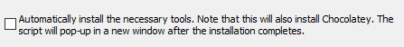

<!-- RUN IN THE TERMINAL, NOT VS CODE INTEGRATED TERMINAL - 
Make sure check tuckbox in node installtaion 

IMPLEMENT LOG LEVEL AS STRATEGY DESIGN PATTERN

Make sure vs code open in root of repo  -->


# TSI Personal Project
## Mod Database
---

This application allows for interaction with an in-memory SQLite3 database storing Minecraft mods.
## Installation
---

1. Download NodeJS installer: [download page here](https://nodejs.org/en/download)
2. Run the  NodeJS installer, ensuring the following option ***IS TICKED***: 

    

    Leave all other settings as they appear
3. If you have not already, make sure to open the repository in the `TSI-PERSONAL-PROJECT` directory in VS Code. Failing to do so can lead to clashes with other testing libraries that you may have installed.
4. From the root of the repository e.g. (C:/route-to-directory/TSI-PERSONAL-PROJECT), run:

    ```bash
    $ npm run setup
    ```
      If NodeJS successfully installed, this will install the projects dependencies (typescript, jest etc.) and initialise the local database with starter data.
---

## Execution
To run the program, from TSI-PERSONAL-PROJECT run:

  ```bash
  $ npm start
  ```
To run all tests, from TSI-PERSONAL-PROJECT run:
  ```bash
  $ npm t
  ```

## Submission Details
---
Class which performs data load can be found here: [AddonDB.ts](https://github.com/CahalCaughey00/tsi-personal-project/blob/main/src/data-layer/AddonDB.ts)

Unit tests can be found in the following directories:
- [test/data-layer](https://github.com/CahalCaughey00/tsi-personal-project/tree/main/test/data-layer) 
- [test/application-layer](https://github.com/CahalCaughey00/tsi-personal-project/tree/main/test/application-layer)


The file found at **test/data-layer/AddonDB.test.ts** contains various stubs and mocks, as well as a database fake which mimcs interaction through mocking/stubbing the required database methods and instead interacting with [pre-defined test-objects](https://github.com/CahalCaughey00/tsi-personal-project/blob/main/test/fixtures.ts)

All other tests - excl. addonMapper.test.ts and fileMapper.test.ts (which dont require doubling) - utilise stubs, mocks, spys or a combination.